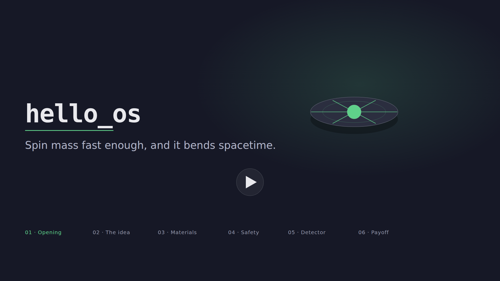

# hello_os — animated explainer

An animated, six-scene explainer for the `hello_os` toy model, imported from a
[Claude Design](https://claude.ai/design) project. It renders as a self-contained
web page: `support.js` bootstraps React, ReactDOM, and Babel from a CDN, then
mounts the scenes.



## Scenes

| # | Scene     | Beat |
|---|-----------|------|
| 1 | Opening   | Wordmark + tagline: *"Spin mass fast enough, and it bends spacetime."* |
| 2 | Idea      | An array of fast-spinning rotors — a tabletop gravitomagnetic field generator. |
| 3 | Materials | The five real materials from `hello_os/core.py`, ranked by safe tip speed. |
| 4 | Safety    | A stress-ratio gauge sweeping GOOD → CAUTION → UNSAFE against the breaking point. |
| 5 | Detector  | The synthetic detector trace: signal recovered from noise, with SNR readout. |
| 6 | Payoff    | `python -m hello_os --optimize` — explore the physics safely, in code. |

The material data, safe-tip-speed formula (`sqrt(3 · tensile / density)`), and the
seeded detector trace mirror the maintained package, so the video stays consistent
with what the code actually computes.

## Files

| File | Role |
|------|------|
| `hello_os Explainer.dc.html` | Entry point (Claude Design component). Declares the scene list, playback, and tweak defaults. |
| `hello-os-video.jsx` | The scenes, palette, material data, and the Tweaks panel wiring. |
| `animations-v2.jsx` | Timeline / scene-sequencing engine (`SceneStage`, `interpolate`, `Easing`, …). |
| `tweaks-panel.jsx` | Reusable live-tweak controls (accent, featured material, captions). |
| `support.js` | Claude Design runtime shim; loads React/ReactDOM/Babel and defines `<x-dc>` / `<x-import>`. |
| `poster.svg` / `poster.png` | Still poster frame used in the READMEs. |

## Run it locally

The page pulls React, ReactDOM, Babel, and the Inter font from CDNs, so serve it
over HTTP (a `file://` open is blocked by the browser's module/CORS rules) with a
network connection:

```bash
cd explainer
python -m http.server 8000
# then open http://localhost:8000/hello_os%20Explainer.dc.html
```

Use the **Tweaks** panel (bottom-right) to change the accent color, swap the
featured material, or toggle captions.

## Editing

This project round-trips with its Claude Design source. To pull the latest
version back down or push local edits, use the `DesignSync` tooling and the
`/design-sync` skill against the project
`Hello_os animated explainer`.
